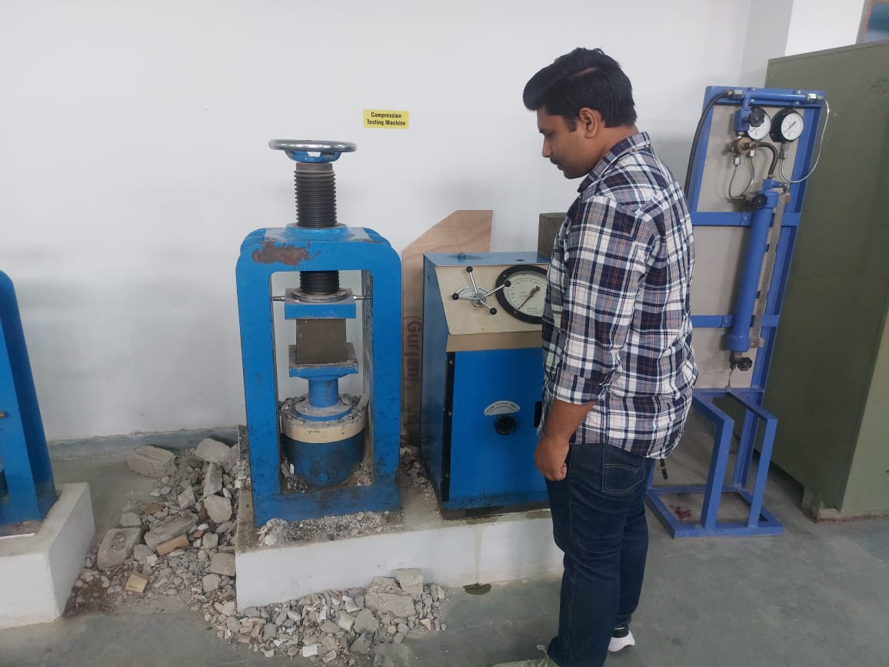
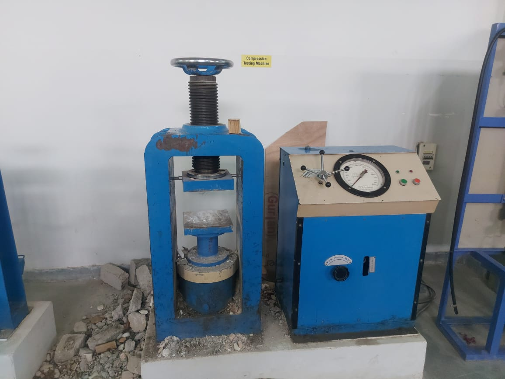
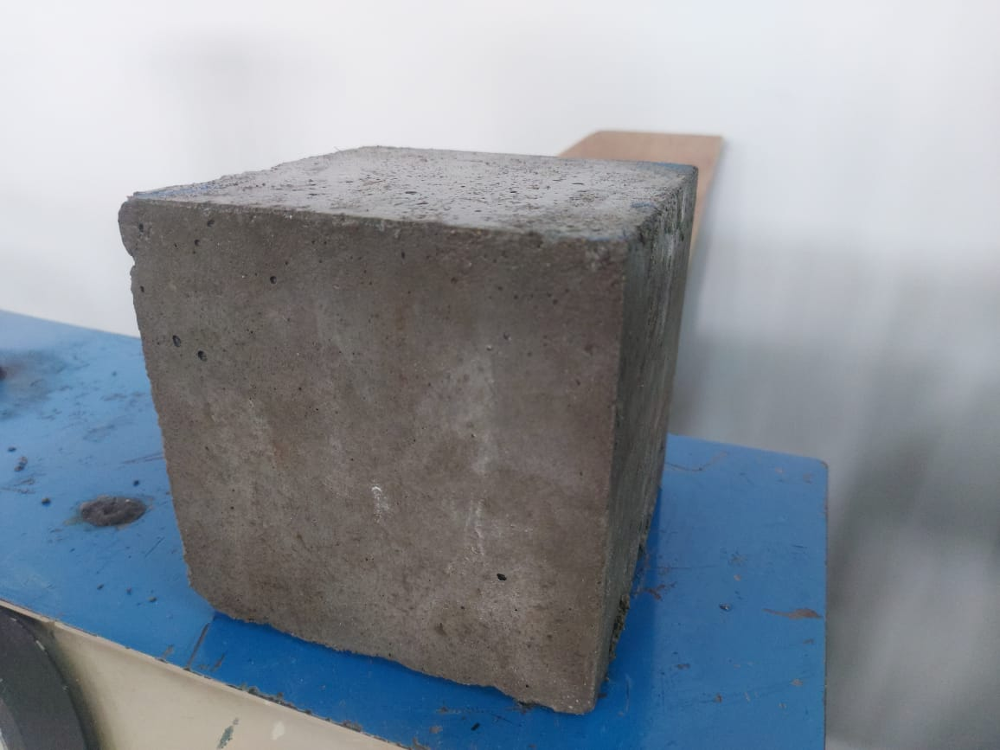
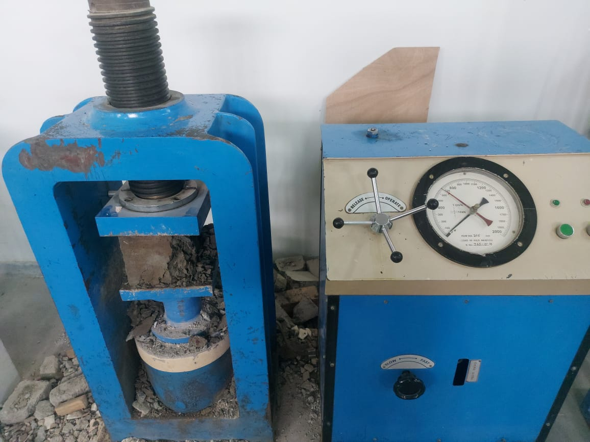
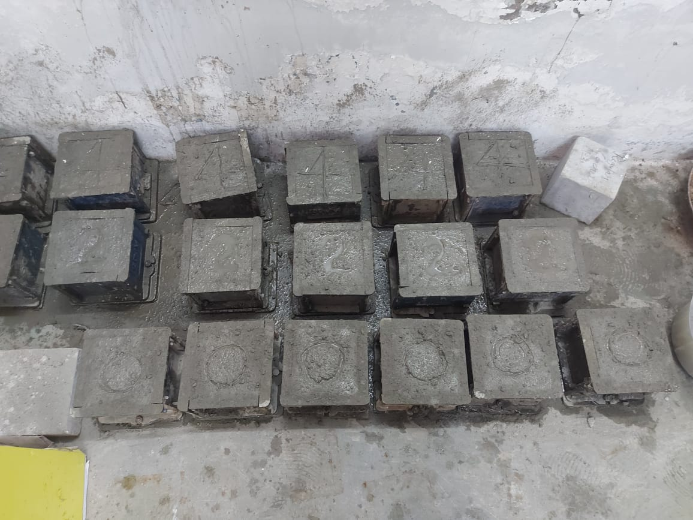
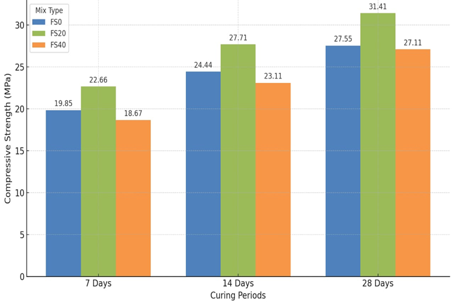
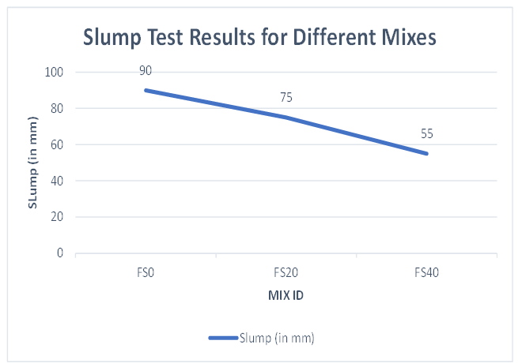
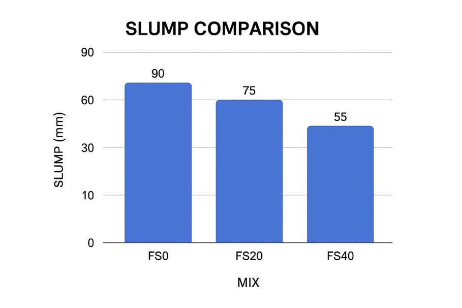

# Sustainable Concrete using Foundry Sand

## 📌 Problem Statement

Natural river sand is rapidly depleting due to excessive use in construction, causing environmental imbalance and increasing costs. At the same time, foundry sand, an industrial waste material, is disposed of in landfills. This project aims to utilize foundry sand as a sustainable alternative in concrete.

---

## 📌 Project Overview

This project investigates the use of **foundry sand as a partial replacement of fine aggregate** in M25 grade concrete to enhance sustainability while maintaining strength and workability.

---

## 🎯 Objectives

* Evaluate foundry sand as an alternative to natural sand
* Analyze workability using slump test
* Measure compressive strength at 7, 14, and 28 days
* Identify optimal replacement level

---

## ⚙️ Methodology

* Concrete Grade: **M25**
* Replacement Levels:

  * FS0 → 0%
  * FS20 → 20%
  * FS40 → 40%
* Tests Conducted:

  * Slump Test
  * Compressive Strength Test (CTM)

---

## 📊 Results

| Mix  | Slump (mm) | 28-Day Strength (MPa) |
| ---- | ---------- | --------------------- |
| FS0  | 90         | 27.55                 |
| FS20 | 75         | **31.41**             |
| FS40 | 55         | 27.11                 |

---

## 📈 Key Insight

👉 **20% replacement (FS20) provides the best performance**, achieving the highest strength while maintaining acceptable workability.

---

## 🧪 Experimental Setup

### 🏗️ Compression Testing Machine (CTM)

  

### ⚙️ Compression Testing Machine (Full View)

   
### 🧱 Concrete Cube Specimen

  
### 📊 Load Application During Testing

   
### 🧩 Concrete Cube Batch

   

---

### 🔹 Compressive Strength vs Curing Days

### 🔹 Slump Test (Line Graph)

### 🔹 Slump Comparison (Bar Chart)

---

## 📊 Data & Analysis

* Experimental data stored in `/data`
* Python script (`analysis.py`) used for visualization
* Strength variation analyzed across curing periods

---

## 🌱 Sustainability Impact

* Reduces dependency on natural river sand
* Utilizes industrial waste (foundry sand)
* Promotes eco-friendly and cost-effective construction

---

## 📂 Project Structure

* `/report` → Project report
* `/data` → Experimental datasets
* `/analysis` → Python analysis
* `/images` → Experimental visuals

---

## 🚀 Future Scope

* Use of admixtures to improve workability
* Durability testing (permeability, shrinkage)
* Real-world construction applications

---

## 👨‍💻 Author

**Pranav Mathur**
